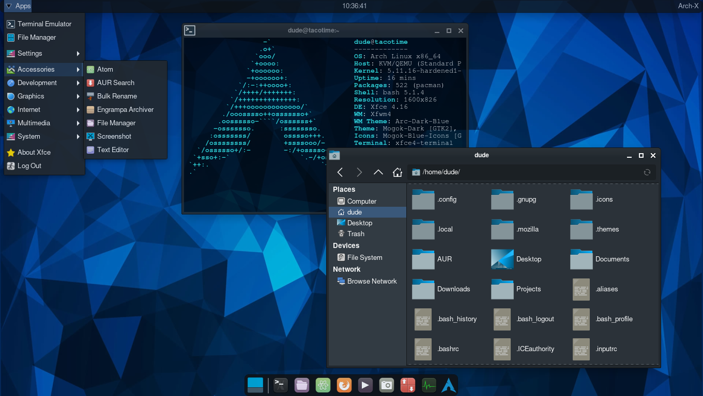

## Arch Xfce Hardened

### About

I made this [Arch Linux](https://archlinux.org/) installer for my own personal use, but it'll work for anyone looking for a lightweight hardened Arch system. My desktop of choice is [Xfce](https://xfce.org/) and includes basic applications and system utilities. It utilizes the [linux-hardened](https://github.com/anthraxx/linux-hardened) kernel and custom configurations for added security. 

To change which apps are installed, you can add or remove them from the [packages](https://github.com/kuladog/arch-x/blob/main/packages) script. Dotfiles and configuration files can be edited, added, or removed from the `home` and `etc` directories. And, of course, read through the [install script](https://github.com/kuladog/arch-xfce-hardened/blob/main/install.sh) to make sure it's gonna do what you want.



### Usage

From the main [Arch Linux](https://archlinux.org/) installer, download this repo with one of the following options.
 
1. Using curl: (included)
```sh
curl -LO https://github.com/kuladog/arch-xfce-hardened/archive/main.zip

bsdtar xf main.zip

cd arch-xfce-hardened-main

bash install.sh
```

2. Using git: (install)
```sh
pacman -Syy

pacman install git

git clone https://github.com/kuladog/arch-xfce-hardened.git

cd arch-xfce-hardened

bash install.sh
```

#### The installer will guide you through the following:
- Choose a device to partition, if in a VM choose (/dev/vda)
- Make up to 3 partions (/, /var, /home). Assumes BIOS/MBR
- Select file system for new partitions (ext4, xfs, btrfs)
- Install the base system and prompt for additional packages
- Add hardened configurations, if you choose to do that
- Prompt for hostname, root passwd, new user, localization, etc..
- Auto-configure grub.cfg, fstab, sudoers, firewalld, etc..
- Set up dotfiles, system theme and icons, $HOME permissions

### Disclaimer

Some things, like the way packages are handled, were done just for the sake of doing it. Please keep in mind it's just a fun project to get some bash time in.. and kill off some pandemic boredom. :grin:
