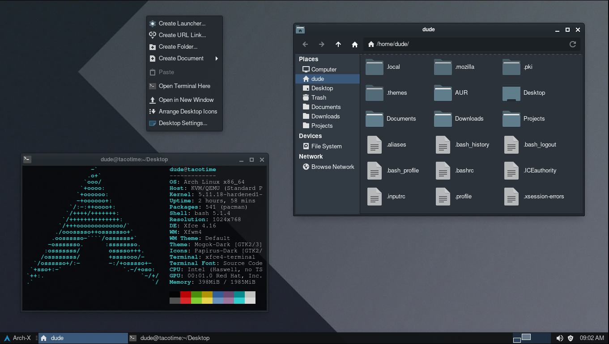

## Arch Xfce Hardened

### About

I made this [Arch Linux](https://archlinux.org/) installer for my own personal use, but it could work for anyone who wants a lightweight hardened system. My desktop of choice is [Xfce](https://xfce.org/) and I've included some basic applications and system utilities. I use the [linux-hardened](https://github.com/anthraxx/linux-hardened) kernel and custom configurations for added security.

To change which apps are installed you can add or remove them from the [packages](https://github.com/kuladog/arch-xfce-hardened/blob/main/packages) script. Dotfiles and configuration files can be edited, added, or removed from the `home` and `etc` directories. And, of course, read through the [install script](https://github.com/kuladog/arch-xfce-hardened/blob/main/install.sh) to make sure it's gonna do what you want.



### Usage

From the main [Arch Linux](https://archlinux.org/) installer, clone this repo with one of the following options.
 
1. Using curl: (included)
```sh
curl -LO https://github.com/kuladog/arch-xfce-hardened/archive/main.zip

bsdtar xf main.zip

cd arch-xfce-hardened-main

bash install.sh
```

2. Using git: (install)
```sh
pacman -Syy

pacman install git

git clone https://github.com/kuladog/arch-xfce-hardened.git

cd arch-xfce-hardened

bash install.sh
```

#### The installer will guide you through the following:
- Choose a device to partition, if in a VM choose (/dev/vda)
- Make 1 to 3 partions via fdisk (/, /var, /home). Assumes BIOS
- Select a file system for new partitions (ext4, xfs, btrfs)
- Installs the base system and prompts for additional packages
- Adds hardened configurations, if you choose to do that
- Prompts for hostname, root passwd, new user and passwd etc..
- Auto-configures grub.cfg, fstab, sudoers, firewalld etc..
- Sets up dotfiles, system theme and icons, $HOME permissions
- When finished, it will clean up installation files and reboot

### Disclaimer

As a general purpose installer it has limitations, but it does what it's supposed to do—for me—perfectly. Please keep in mind it's just a fun project to get some bash time in.. and kill off some pandemic boredom. :smiley:
