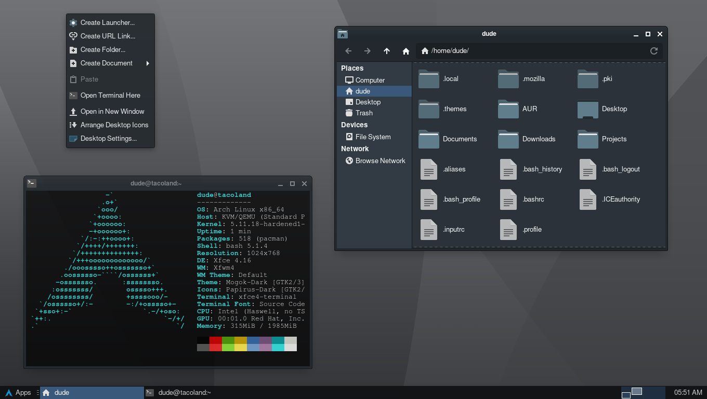

## Arch Xfce Hardened (Arch-X)

### About

I made this [Arch Linux](https://archlinux.org/) installer for my own personal use, but
it could work for anyone who wants a lightweight hardened system that works and looks
good out of the box. To change which apps are installed, you can add or remove them from
the [packages](https://github.com/kuladog/arch-xfce-hardened/blob/main/packages) script.
Dotfiles and configuration files can be edited, added, or removed from the `dotfiles`
and `configs` directories.

Read through the [install script](https://github.com/kuladog/arch-xfce-hardened/blob/main/install.sh)
to make sure it's gonna do what you want.



### Usage

From the [Archiso](https://archlinux.org/download/) live environment, just download the
repo and run the script.

1. Using curl: (included in archiso)
```sh
curl -LO https://github.com/kuladog/arch-xfce-hardened/archive/main.zip

bsdtar xf main.zip

cd arch-xfce-hardened-main

bash install.sh
```

### Disclaimer

This was just a fun project to get some bash time in... and kill off some pandemic
boredom. It has limitations, but does what it's supposed to do—for me—perfectly. :smiley:
